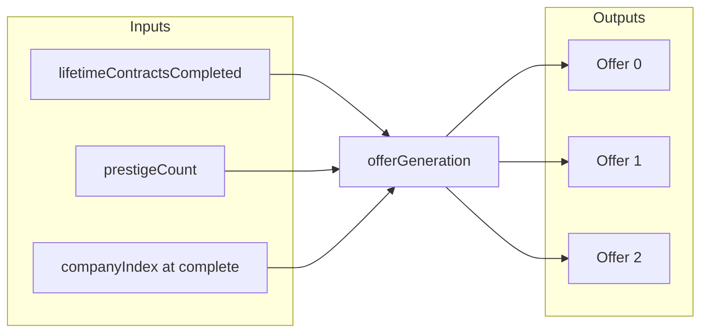
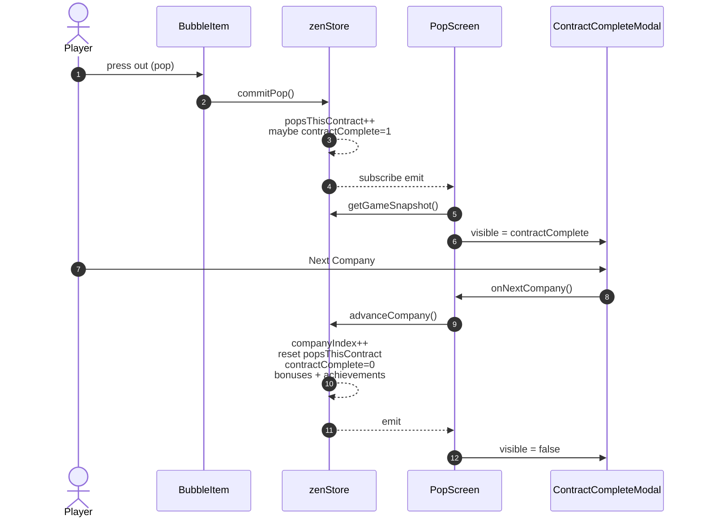
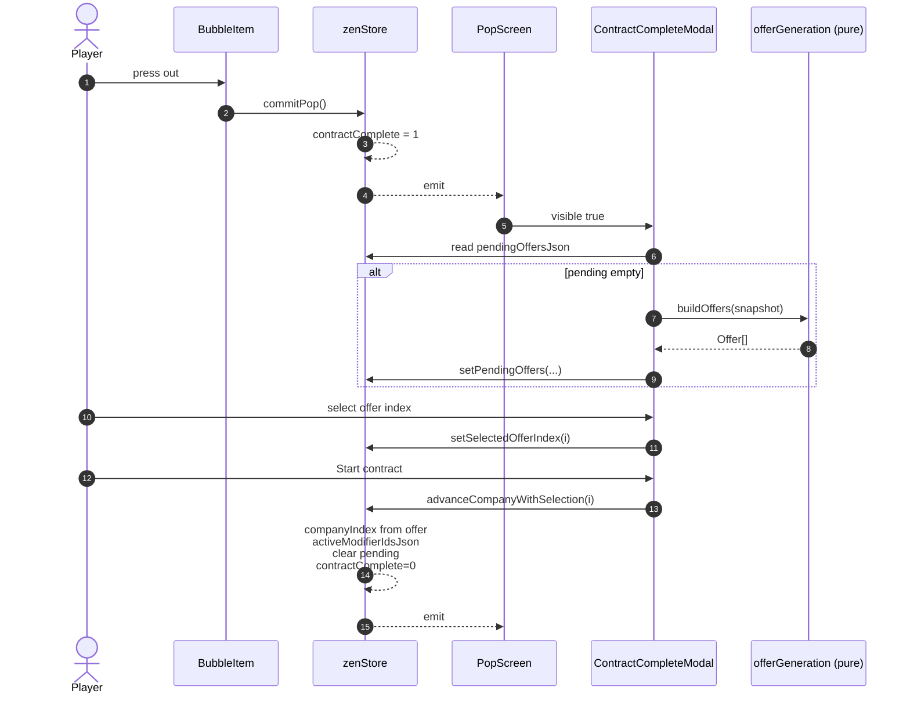
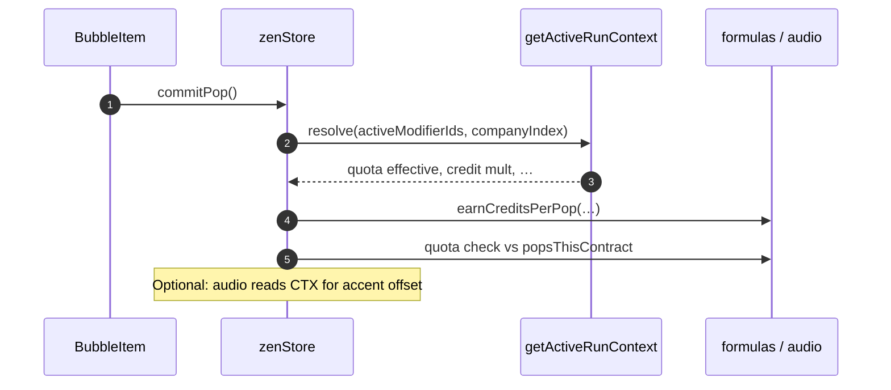
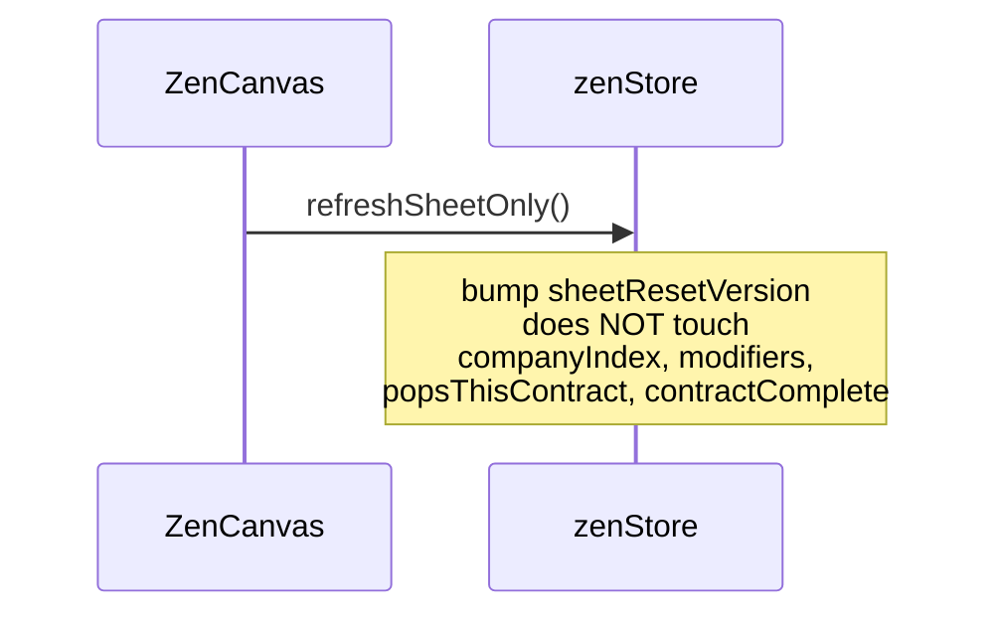
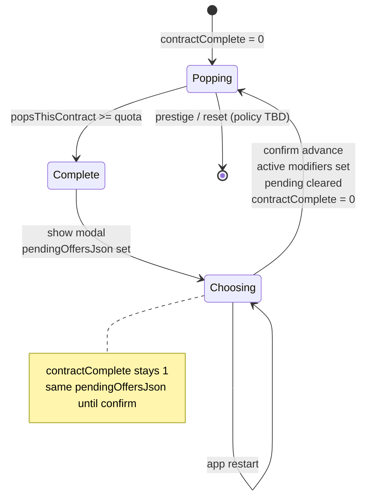

# Choose Next Company + Run Modifiers — Spec (draft)

Living design doc for the **Gameplay / progression** item in `Future_Improvements_and_Known_Issues.md`. Implementation order is suggested at the end; nothing here is committed until built.

## 1. Problem & intent

**Today:** Finishing a contract shows `ContractCompleteModal` with a single **Next Company →** action. `advanceCompany()` increments `companyIndex` by one and wraps the static roster via `companyAt()`; quota scales with index (`quotaForCompany` in `economy/formulas.ts`). There is no player agency over *which* narrative client comes next, and no per-run variation beyond prestige and Shop upgrades.

**Goal:** After a contract completes, the player **picks the next engagement** from a small, readable set of options. Each option can carry **lightweight run modifiers** (bonuses or tradeoffs) so sessions feel different without overwhelming the core pop-and-breathe loop. Everything stays **offline-first** (no network).

**Non-goals (v1):** Competitive leaderboards, live events, narrative branching trees, or modifiers that require new art systems or heavy tutorial copy.

## 2. Principles (must hold)

| Principle | Implication |
|-----------|-------------|
| **Calm UX** | At most **3** offers after a contract; default selection path stays **one confirm** after choice (no nested wizards). |
| **Readable** | Each offer shows: **name**, **one-line pitch**, **at most two** modifier chips (icon + short label). |
| **Fair** | No offer should be a strict downgrade with no upside unless clearly labeled *challenge* and optional (player can pick another). |
| **Deterministic offline** | Offers and modifier rolls are derived from **seeded or counter-based** rules (e.g. `lifetimeContractsCompleted`, `companyIndex`, optional `runNonce`) so behavior is reproducible and testable. |
| **Zen-safe** | Modifiers affect **economy / quota / feedback tuning**, not mandatory precision challenges (avoid “smaller hit targets” unless tied to an explicit opt-in difficulty offer). |

## 3. Concepts

### 3.1 Offer

An **offer** is one row the player can select after contract complete. It references:

- A **client** (either a `CompanyDef` from `content/companies.ts` or a generated “gig” label reusing the same tone), and  
- **Zero to two** **run modifiers** active for the *next* contract only (the run starts when the player confirms and `advanceCompany`-equivalent runs).

### 3.2 Run

A **run** = one contract from first pop after advance until `contractComplete` again. **Run modifiers** apply only to that contract unless explicitly defined as “until prestige” (avoid for v1).

### 3.3 Modifier (v1 shape)

Modifiers are **data-driven** records applied in known hooks (see §7). Suggested TypeScript shape (illustrative):

```ts
type ModifierId = string; // stable id, e.g. 'credits_rich' | 'quota_tight'

type RunModifierDef = {
  id: ModifierId;
  /** Short UI label, e.g. "+Credits" */
  label: string;
  /** Optional longer hint for accessibility / long-press */
  description?: string;
};
```

Stacking: **v1** either disallow stacking two modifiers of the same *category* (economy vs quota) or allow at most **two** modifiers total per offer with no duplicate ids.

## 4. Player flow (UX)

1. Player completes quota → existing `contractComplete` state; modal or full-screen sheet appears (reuse calm modal styling from `ContractCompleteModal`).
2. **Celebrate** current client (existing company name + flavor line is fine).
3. Section **“Next engagement”** lists **2–3 offers** (cards or radio list). One offer may be highlighted as **recommended** (slightly brighter border) using deterministic rules—not dark patterns.
4. Tapping an offer selects it; primary button becomes **Start contract** (or keep **Next Company →** copy if brand prefers).
5. Optional: **Details** chevron expands inline text for modifiers (keeps default view quiet).
6. **Review stats** secondary action unchanged (navigate to Progress).
7. On confirm: persist chosen `nextCompanyIndex` / `activeRunModifiersJson`, reset contract fields, bump sheet reset, same counters as today (`companiesCompleted`, `lifetimeContractsCompleted`, achievement hooks).

**Empty / migration edge:** If save has no modifier system yet, first open uses offers with **modifiers optional** so first-time players are not flooded.

## 5. Offer generation (design)

**Roster coupling:** Offers can be **three distinct companies** drawn from `COMPANIES` with indices derived from a deterministic function of `(lifetimeContractsCompleted, prestigeCount)` so the same “slot” doesn’t always show the same three names early game. Alternatively, **one** company is fixed as “story” and two are **variants** of the same client with different modifiers (cheaper content).

**Guarantees:**

- Always at least one offer with **no negative economic modifier** (new players).
- After N lifetime contracts, allow **optional challenge** offers (see §6).

**Anti-frustration:** If the player force-quits before confirming, remain in `contractComplete` with the same generated offers until they confirm (offers cached in MMKV for that completion).

## 6. Modifier families (readable on a small screen)

Each family should have **at most a few** concrete ids for v1. Copy should be wry, corporate-satire aligned with existing `flavorLine` tone.

| Family | Player-facing theme | Example effects (hook into §7) |
|--------|---------------------|----------------------------------|
| **Economy** | “Billable hours” / stipend | ±Credits per pop (`earnCreditsPerPop` input); flat completion bonus (`contractCompletionCreditsBonus`). |
| **Quota** | “Scope creep” / “Lean sprint” | ±`quotaForCompany` effective pops (clamp to sane min/max, e.g. 250–800). |
| **Comfort** | “Ergonomic audit” | ±implicit “comfort” only if expressed through existing upgrades—prefer **not** to negate purchased Shop tiers; instead add a **temporary overlay** (e.g. +4 hit slop equivalent) that stacks with Shop or caps. |
| **Sensory (gentle)** | “Open office” / “Focus suite” | ±accent volume band within safe bounds; never force sound on when global Sound is off. |
| **Challenge (opt-in)** | “Crunch week” | Higher quota + higher credits; clearly badged **Challenge** chip. |

**Explicitly out of v1:** Modifiers that change grid size, FlashList layout, or bubble count (high risk for perf and QA).

## 7. Engine hooks (where modifiers apply)

Centralize reads in a small helper, e.g. `getActiveRunContext(): { quotaDelta: number; creditsPerPopMultiplier: number; ... }`, defaulting to identity when no run modifiers.

| Hook | Today | With modifiers |
|------|--------|----------------|
| Contract quota | `quotaForCompany(companyIndex)` | `effectiveQuota = base + sum(quotaDelta)` |
| Credits per pop | `earnCreditsPerPop` | multiply or add tier from modifier table |
| Completion bonus | `contractCompletionCreditsBonus()` (stub 0) | use as primary “payout” knob for offers |
| Pop audio accent | `getPopAccentVolume()` | optional small offset within clamp |
| Haptics | `engine/haptics.ts` | optional intensity tier (if added later) |

**Clearing modifiers:** When `contractComplete` flips to `1`, optionally **expire** “this run only” modifiers from state, or expire on **next** `advanceCompany` after choice—pick one rule and document in code comments.

## 8. Persistence (proposed MMKV keys)

Names are illustrative; align with `KEYS` style in `zenStore/keys.ts`.

| Key | Type | Purpose |
|-----|------|---------|
| `pendingOffersJson` | string | Serialized offers shown for current completion (survives app restart mid-modal). |
| `selectedOfferIndex` | number | Which offer is highlighted (0–2). |
| `activeModifierIdsJson` | string | JSON array of modifier ids for **current** run (post-confirm). |
| `companyIndex` | number | **Unchanged semantically** but may be set from **chosen** offer’s client instead of +1 only. |

**Relationship to `advanceCompany`:** Replace or refactor into `advanceCompanyWithSelection(offerIndex)` that: validates contract complete, applies chosen company index + modifiers, grants bonuses, resets pop count, bumps lifetime counters, `bumpSheetReset`, `emit`.

**Prestige:** On prestige reset policy—modifiers on the **current** incomplete run should cancel; completed contract modifiers already cleared. Document in zenStore when prestige is implemented for run state.

## 9. Content tables

- `content/companies.ts` — may gain optional `tags` or `tier` for weighting offers (optional).
- New `content/runModifiers.ts` — static defs: id, label, description, category, numeric params (or small union of param shapes).
- New `content/offerGeneration.ts` (pure functions, unit-tested) — inputs: snapshot fields; outputs: `Offer[]`.

## 10. UI components

- Evolve `ContractCompleteModal` into **ContractCompleteSheet** or add inner **OfferPicker** subcomponent: accessible radio group, large touch targets, theme tokens from `theme/tokens.ts`.
- `ContractHeader` should optionally show **modifier chips** for the active run (subtle; don’t clutter quota bar).

## Diagrams (Mermaid)

GitHub and many Markdown previews render these natively. Direction: **LR** = left-to-right, **TB** = top-to-bottom.

### Data flow — target architecture (storage, generation, hooks)

Shows how completion triggers offer persistence, how confirmation writes the active run, and where gameplay reads modifier context.

```mermaid
flowchart TB
  subgraph UI["Pop tab UI"]
    ZC[ZenCanvas / BubbleItem]
    CCM[ContractCompleteModal + OfferPicker]
    CH[ContractHeader]
  end

  subgraph Store["zenStore (MMKV)"]
    CC{{contractComplete}}
    PTC[popsThisContract]
    CI[companyIndex]
    PEND[pendingOffersJson]
    SEL[selectedOfferIndex]
    ACT[activeModifierIdsJson]
    LC[lifetimeContractsCompleted]
    SR[sheetResetVersion]
  end

  subgraph Pure["Pure / content (no I/O)"]
    OG[offerGeneration.ts]
    RM[runModifiers.ts]
    CTX[getActiveRunContext]
    Q[quotaForCompany + deltas]
    E[earnCreditsPerPop + mults]
  end

  ZC -->|commitPop| Store
  Store -->|ptc >= quota| CC
  CC -->|true: show modal| CCM
  CCM -->|on mount / if pending empty| OG
  OG -->|deterministic Offer[]| PEND
  CCM -->|tap offer| SEL
  CCM -->|confirm Start contract| Store
  Store -->|advanceCompanyWithSelection| CI
  Store -->|write modifier ids| ACT
  Store -->|bump| SR
  Store -->|clear pending| PEND

  CH -->|reads snapshot| CTX
  ZC -->|commitPop reads| CTX
  ACT --> CTX
  RM -.->|defs by id| CTX
  CI --> Q
  CTX --> Q
  CTX --> E
```

### Data flow — offer generation inputs (deterministic slice)



### Sequence — baseline today (single Next Company)



### Sequence — target: generate offers, select, confirm



### Sequence — read path during active run (every pop)



### Sequence — pull-to-refresh (new sheet only)

Per `Pop_and_Breathe_Spec.md`, refresh must **not** clear contract progress. Diagram anchors that invariant against the new feature.



### State machine — contract completion & pending offers



## 11. Testing

- Pure: offer generation determinism, modifier math on `effectiveQuota` / credits.
- Store: one integration test for “complete contract → select offer → advance” counter and cleared modifiers.

## 12. Phased delivery

| Phase | Scope |
|-------|--------|
| **A** | UI: 3 offers, **no** modifiers—only choice of **which `companyIndex`** to take next (still deterministic generation). Wire persistence + `advanceCompany` refactor. |
| **B** | Add `runModifiers.ts` + **one** economy and **one** quota modifier; show chips. |
| **C** | Challenge offers + completion bonus hook; header chips polish. |

## 13. Open questions

- Should **quota curve** stay tied to global `companyIndex`, or per **lifetimeContractsCompleted** only, so chosen “company” is mostly flavor? (Flavor-only simplifies balance.)
- Maximum modifier **duration**: strict one contract vs. “until next shop visit” (probably too vague).
- Localization: v1 English-only strings in content tables are fine.

## Change log

- **2026-04-21**: Added Mermaid **data flow** and **sequence** diagrams (target vs baseline, pop read path, refresh invariant, state machine).
- **2026-04-21**: Initial draft from existing `zenStore` / `companies` / `ContractCompleteModal` / `formulas` behavior.
