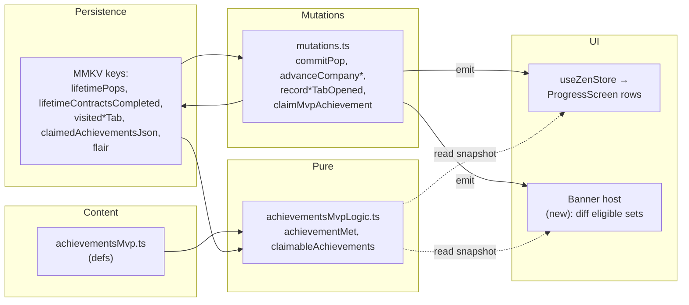
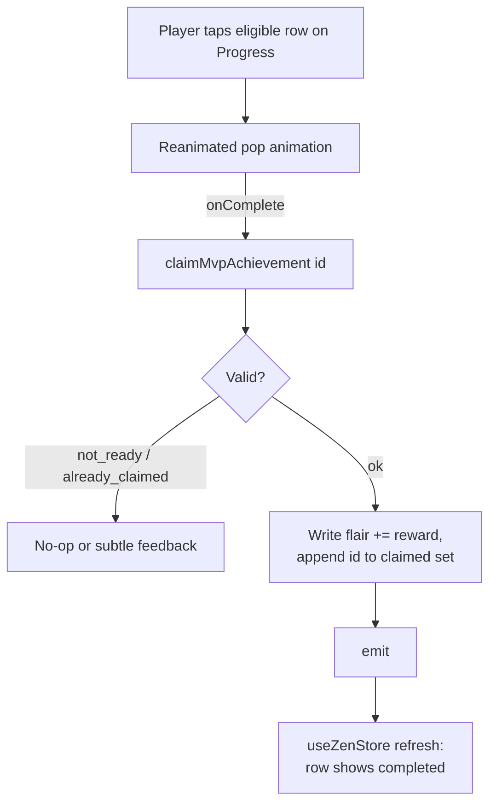
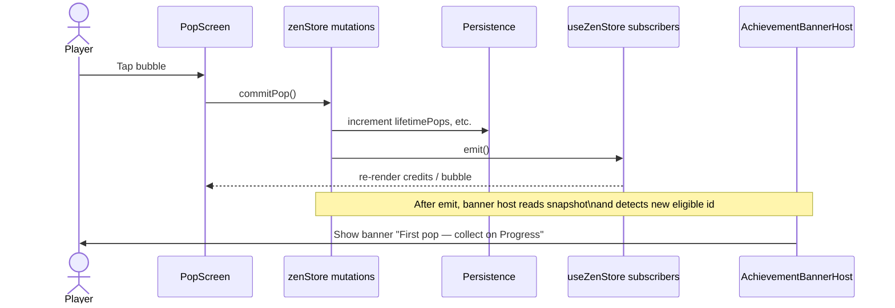
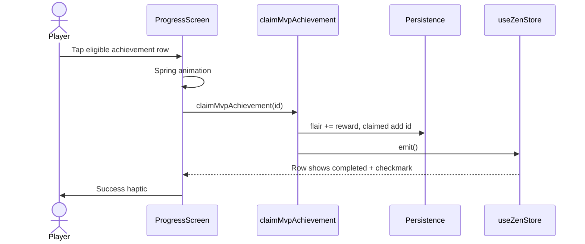
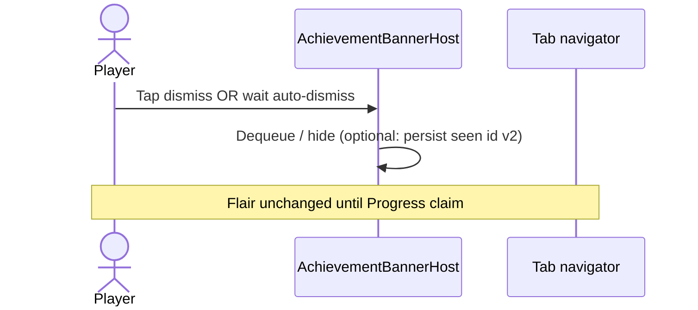

# Achievements UX — Tap-to-Claim & “Earned” Banner (Spec)

**Audience:** Engineers, QA, design  
**Status:** Draft for alignment (implementation partially exists; banner is **not** implemented yet)  
**Related:** `docs/phase_3_achievements_handoff.md` (Phase 3 roadmap), `docs/Pop_and_Breathe_Spec.md` (economy fields), `src/content/achievementsMvp.ts`, `src/economy/achievementsMvpLogic.ts`, `src/storage/zenStore/`

**Supersedes** the older handoff note that described MVP achievements as **auto-granting** Flair on threshold. Product direction from testing: **no auto-complete**; player **taps** on Progress to collect, with optional **banner** when requirements are first satisfied.

---

## 1. Goals

| # | Goal |
|---|------|
| G1 | Achievements **never** grant Flair or mark themselves “claimed” without an explicit **player action** on the Progress list (tap-to-claim). |
| G2 | When the player **first satisfies** the requirements for an achievement they have **not yet claimed**, show a **banner-style** notice (“achievement earned” / ready to collect) so the moment is visible outside Progress. |
| G3 | Progress screen remains the **canonical** place to see full copy, progress meters, claim animation, and completed vs in-progress **visual differentiation**. |
| G4 | **Calm** zen loop: banner must not hijack Pop interactions (dismissible, short, no mandatory navigation). |

---

## 2. Definitions

| Term | Meaning |
|------|---------|
| **Requirements met** | `achievementMet(def, input) === true` for that definition (pure function in `achievementsMvpLogic.ts`). |
| **Claimed** | Achievement id is present in `claimedAchievementsJson` (persisted set); Flair for that row has been applied. |
| **Eligible (claimable)** | Requirements met **and** not claimed. This is the only state where `claimMvpAchievement(id)` returns `'ok'`. |
| **Locked** | Requirements not met. |

**Important:** “Earned” in tester language maps best to **requirements met** (the achievement is *won*), while **Flair** is granted only on **claim** (tap). The banner should communicate both: celebration + “collect on Progress.”

---

## 3. Current implementation (baseline)

The following already exists in code and should be treated as **source of truth** unless this spec explicitly changes it.

| Area | Behavior | Primary files |
|------|----------|----------------|
| Threshold evaluation | Pure helpers: `achievementMet`, `achievementProgressParts`, `claimableAchievements` | `src/economy/achievementsMvpLogic.ts` |
| Claim mutation | `claimMvpAchievement(id)` → flair += `rewardFlair`, id appended to claimed set, `emit()` | `src/storage/zenStore/mutations.ts` |
| No auto-claim on pop / contract / tab flags | `commitPop`, `advanceCompanyWithSelection`, `recordProgressTabOpened`, `recordShopTabOpened` update counters only | `src/storage/zenStore/mutations.ts` |
| Progress UI | Press row → Reanimated spring → `claimMvpAchievement` → success haptic; row styles for locked / eligible / claimed | `src/screens/ProgressScreen.tsx` |
| Migration | Phase 3 migration seeds `lifetimeContractsCompleted`; does **not** bulk-claim achievements | `src/storage/zenStore/helpers.ts` |

**Persistence today:** `claimedAchievementsJson`, counters (`lifetimePops`, `lifetimeContractsCompleted`, tab visit flags), and `flair`.

---

## 4. Proposed: banner when requirements are met

### 4.1 Trigger

Fire the banner when an achievement transitions into **eligible** for the first time since the player last “acknowledged” it in the banner context, **or** (simpler v1) the first time in a **session** the app observes a **new** eligible id compared to the post-mutation evaluation.

**Recommended v1 (minimal persistence):**

- After each mutation that can change achievement input (see §4.3), compute the set `E = { id | achievementMet && !claimed }`.
- Compare to `E_prev` held in memory (module-level or React ref in a root host).
- For each `id ∈ E \ E_prev`, enqueue one banner payload `{ id, title, rewardFlair }` (or enqueue in definition order).
- Update `E_prev := E`.

**Optional v2 (no repeat after cold start):**

- Persist `achievementBannerSeenEligibleJson` (array of ids) for ids for which we already showed the “requirements met” banner.
- On enqueue, skip ids in that set; on banner dismiss or tap-through, append id to set.

Tradeoff: v2 avoids nagging returning players who never claimed; v1 is simpler and still stops repeating until **new** eligibility appears.

### 4.2 Presentation

- **Placement:** Overlay **above** tab content but **below** any modal scrims; suggested mount point: `RootTabs` sibling `View` with `StyleSheet.absoluteFillObject` + `pointerEvents="box-none"`, or a small wrapper in `App.tsx` outside individual tab screens so the banner is visible on **Pop**, **Shop**, and **Progress**.
- **Visual:** Compact **banner** (not full-screen): icon + title + one line (“+N Flair — collect on Progress”) + dismiss (X) or swipe-away; optional **CTA** “View” that switches tab to Progress (React Navigation `navigation.navigate('Progress')`).
- **Timing:** Auto-dismiss after ~4s if user ignores; pausing if another banner is queued: show **FIFO** or **collapse** multiple into “2 achievements ready on Progress” (product choice — spec recommends **FIFO** for v1).
- **Haptics:** Light impact on show (respect `hapticsEnabled`); do **not** duplicate success notification until **claim** (already `popComplete` on Progress).

### 4.3 Events that must re-evaluate eligibility

Any code path that updates `AchievementProgressInput` fields:

| Source | Fields affected |
|--------|------------------|
| `commitPop` | `lifetimePops` |
| `advanceCompanyWithSelection` | `lifetimeContractsCompleted` |
| `recordProgressTabOpened` | `visitedProgress` |
| `recordShopTabOpened` | `visitedShop` |

**Note:** Opening Progress both sets the visit flag (may make another achievement eligible) **and** is where claims happen; banner evaluation order should run **after** the mutation writes and `emit()`, so subscribers and banner host see consistent state.

### 4.4 Edge cases

| Case | Expected behavior |
|------|-------------------|
| Multiple achievements become eligible in one mutation (e.g. first pop + already visited both tabs) | Queue multiple banners or show one summary (v1: FIFO). |
| Player already on Progress when eligibility flips | Rare (tab visit achievements). Still show banner **or** skip if current route is Progress (product: **skip** banner if focused tab is Progress to reduce noise). |
| Claim from Progress | Eligible set shrinks; no banner for claim itself unless a **separate** “Flair collected” toast is desired later (out of scope). |
| Prestige | Lifetime counters and claims preserved per existing rules; banner logic only reads current snapshot. |

---

## 5. Data flow

High-level: **content defs** + **persisted game counters/claims** → pure **evaluation** → **UI state** on Progress; **mutations** update persistence and **emit**; **banner host** derives “newly eligible” from diff of evaluations.

**Claim-only write path:**

---

## 6. Sequence diagrams

### 6.1 Player earns eligibility on Pop (e.g. first pop)

### 6.2 Player collects on Progress (tap-to-claim)

### 6.3 Player dismisses banner without claiming

---

## 7. Navigation & layering

| Layer | Responsibility |
|-------|----------------|
| `RootTabs` (or `App`) | Host `AchievementBannerHost` with absolute positioning, `zIndex` above scene, `pointerEvents` so Pop gestures still work outside the banner hitbox. |
| `ProgressScreen` | List, animations, `claimMvpAchievement` only. |
| Banner CTA “Progress” | `navigation.navigate('Progress')` from host (needs `navigation` ref or `CommonActions` from container). |

---

## 8. Analytics (optional, future)

If product adds telemetry: `achievement_eligible` (id), `achievement_banner_shown`, `achievement_banner_dismiss`, `achievement_claimed` (id, source: progress_row). Not required for MVP banner.

---

## 9. Test plan

### 9.1 Unit tests (existing / extend)

| Suite | Cases |
|-------|--------|
| `achievementsMvpLogic.test.ts` | `achievementMet`, `claimableAchievements` permutations (already present); add cases for `visited_*` if needed. |
| `zenStore.phaseb.test.ts` (or dedicated achievement integration file) | `claimMvpAchievement` returns `'not_ready'` before threshold, `'ok'` once, `'already_claimed'` on second call; flair math per def. |
| Pure **banner diff** helper (if extracted) | Given two eligible sets, returns correct `newIds` in stable order. |

### 9.2 Component / integration (manual QA checklist)

| # | Steps | Expected |
|---|--------|----------|
| Q1 | Fresh install, first pop only | Banner for `first_pop` (if implemented); Progress shows row **Ready**; flair 0 until tap. |
| Q2 | Tap claim on Progress | Animation, flair increases, row **Complete**, no second grant on repeat tap. |
| Q3 | Complete contract without visiting Progress | Eligible for contract achievement; banner after `advanceCompany*`; claim awards flair once. |
| Q4 | Open Shop tab then Progress | `visited_shop` eligible; claim works; banner order if multiple queued. |
| Q5 | Banner dismiss | No flair change; Progress still shows **Ready** until claim. |
| Q6 | Haptics off | No impact on claim; banner haptics off if wired. |
| Q7 | Prestige after cosmetics | Achievements and flair preserved; no duplicate claims. |

### 9.3 E2E (if Detox / Maestro added later)

Automate Q1–Q2 and banner visibility assertions on Pop screen.

---

## 10. Implementation checklist (banner)

1. [ ] Add `AchievementBannerHost` component + queue state.  
2. [ ] Subscribe to `useZenStore` **or** single `getGameSnapshot` + subscription in `subscribeZenStore` to run diff after emits.  
3. [ ] Wire post-mutation evaluation (or rely on snapshot after every `emit` from listed mutations).  
4. [ ] Style banner with `makeTheme(themeMode)` for dark/light.  
5. [ ] Optional: `navigation.navigate('Progress')` on CTA.  
6. [ ] Tests for diff helper + manual QA matrix sign-off.  
7. [ ] Update `docs/phase_3_achievements_handoff.md` §0 / table row to link **tap-to-claim** + this doc (single-line editorial).  

---

## 11. Open questions (resolve with PM / design)

1. **Exact banner copy:** “Achievement unlocked” vs “Ready to collect” to avoid implying Flair is already banked.  
2. **Single vs stacked** notifications when 3 become eligible at once.  
3. **On Progress tab:** suppress banner or still show (§4.4).  
4. **v1 vs v2** persistence for “already shown” banner per achievement id.  

---

*End of spec.*
