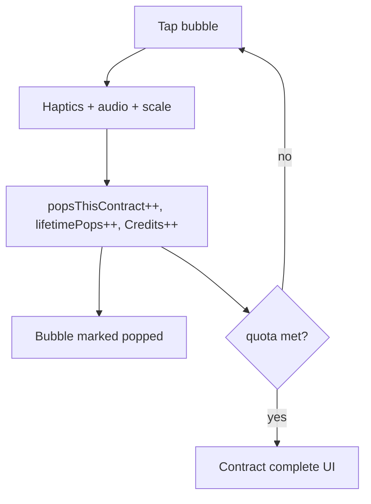
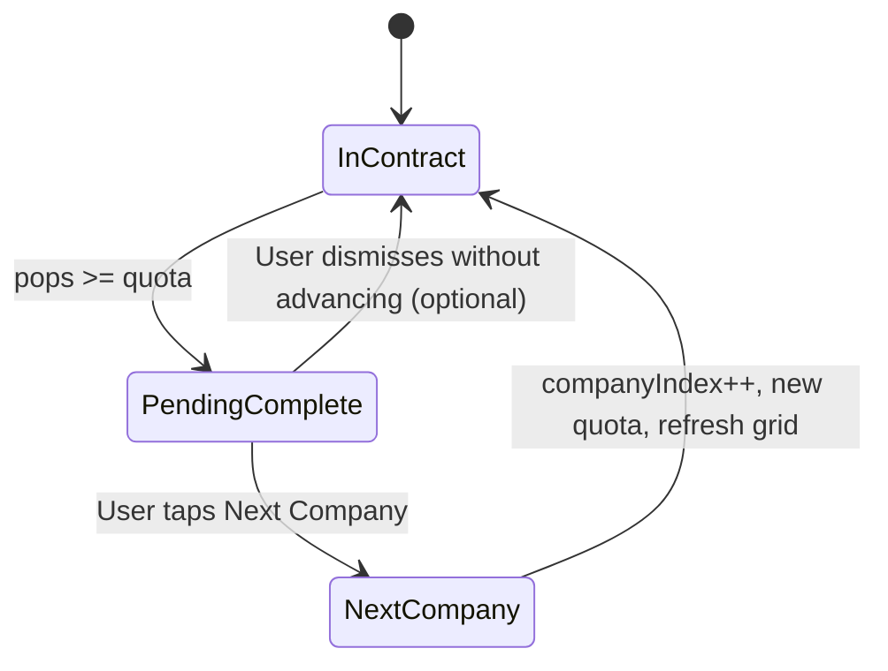
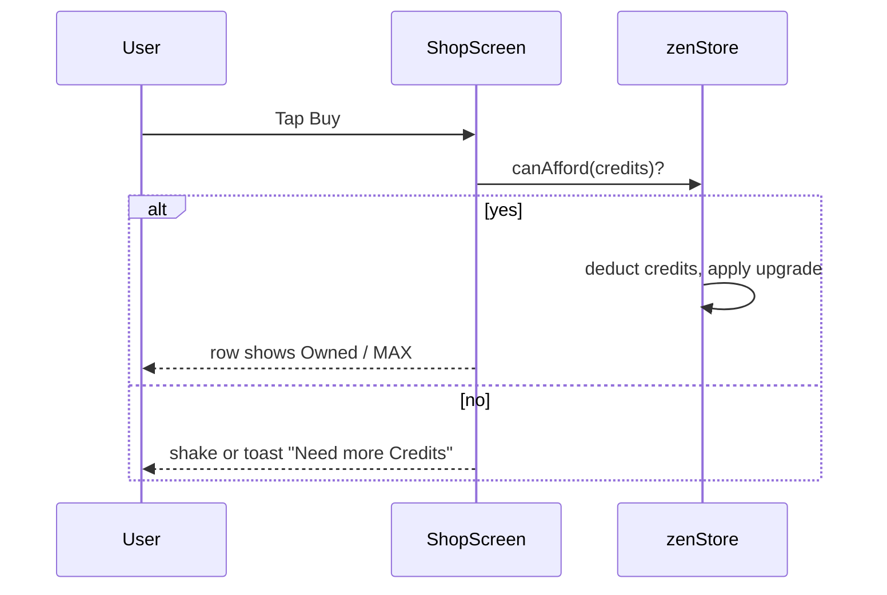
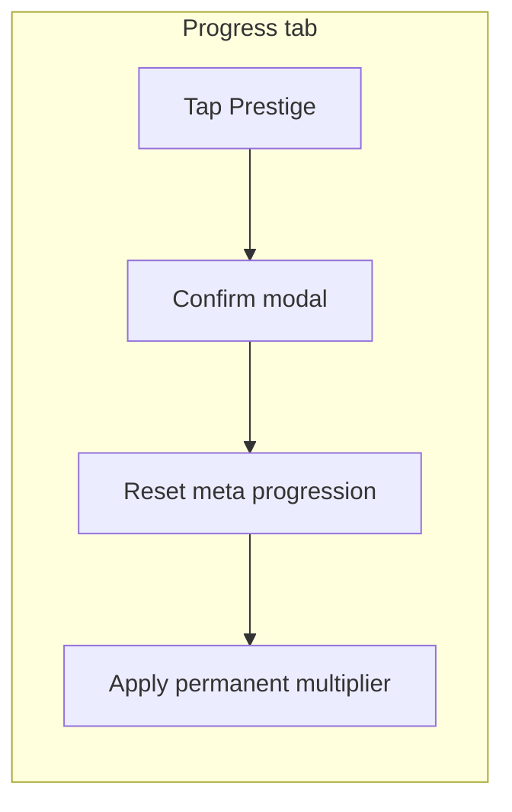
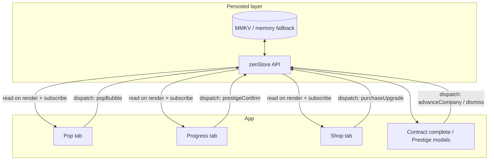
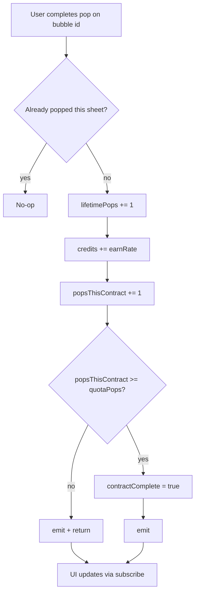
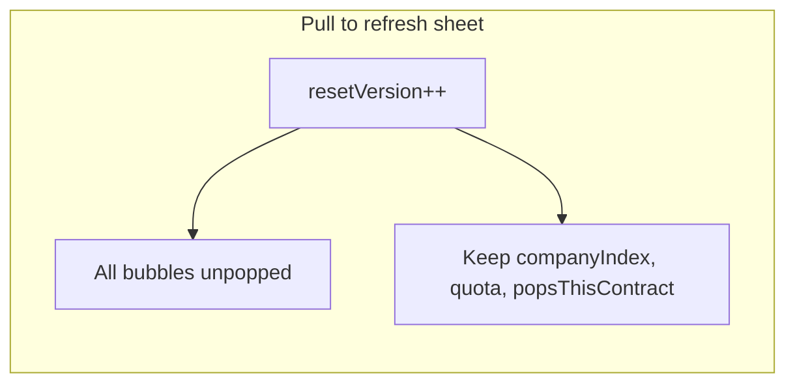
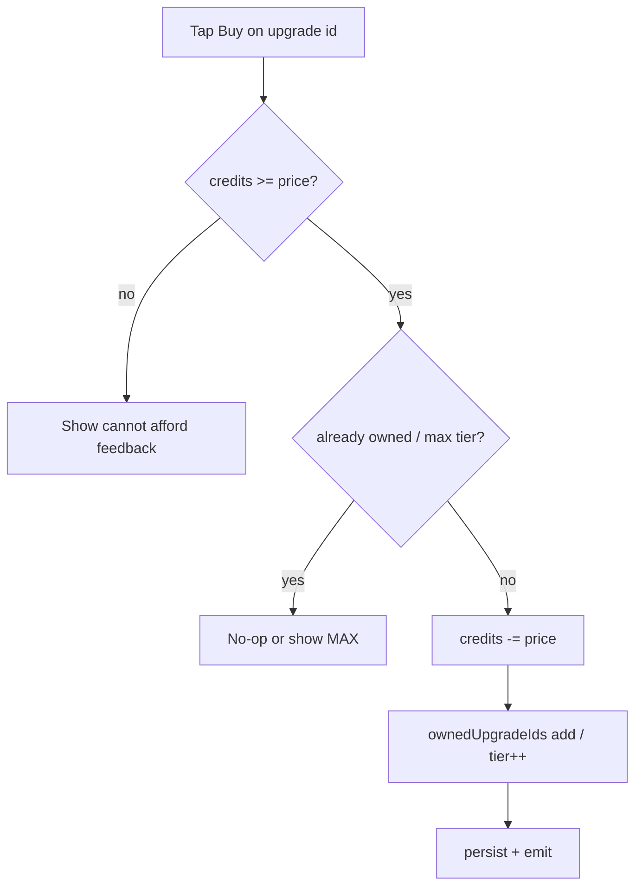
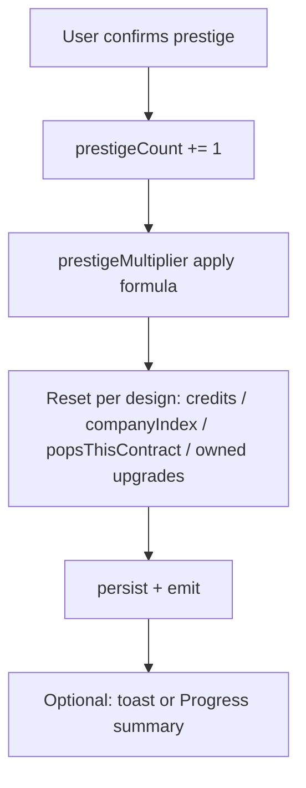

# Pop & Breathe — Phase B Game Design Handoff (Corporate Contracts)

**Audience:** Implementing engineer / agent  
**Status:** Design direction for **Phase B** — not fully implemented in repo  
**Aligned with:** `docs/Pop_and_Breathe_Spec.md` (update when mechanics ship)

---

## 0. Premise (locked)

You are an **absurdly dedicated bubble-wrap technician**. **Companies outsource every popping job** to you—overflow inventory, QA stress tests, executive “mindfulness” initiatives. Your job: **clear the sheet**, hit the **contract quota**, and move to the **next client**.

Tone: **dry workplace satire**, not mean-spirited. UI stays **readable and calm**; jokes live in **company names**, **micro-copy**, and **progress milestones**.

**Monetization:** **None.** Free-to-play, **no IAP**, no ads in this design pass (add later only if product asks).

---

## 1. Phase B scope (what this document enables)

| In scope | Out of scope (later phases) |
|----------|-----------------------------|
| **Framed playfield** + **ambient layer** (see pillars below) | Ads, IAP, accounts, cloud save |
| **Bottom tabs:** **Pop** · **Progress** · **Shop** | Deep narrative / multiplayer |
| **Contract quota** per “company”; **Next Company** transition | Seasonal events |
| **Soft currency** + **Shop** purchases (upgrades/cosmetics) | Real-money storefront |
| **Prestige** entry point on **Progress** tab | Balance tuning numbers (use placeholders) |

**Design pillars (unchanged):**

| # | Pillar | UI meaning |
|---|--------|------------|
| 1 | **Framed playfield** | Bubble grid in a **raised tray** (inner shadow, rim)—clearly “the work surface.” |
| 2 | **Ambient idle life** | Slow gradient drift / optional **tray breathe**—no chaotic particles on every tap. |

---

## 2. Core economy (Phase B)

### 2.1 Resources (recommended naming)

| Name | Role |
|------|------|
| **Pops** | Every completed bubble pop increments **contract progress** and **lifetime stats**. |
| **Credits** | Spendable currency (see formula below). Shop spends **Credits** only. |

**Credits formula (simplest for implementation):**  
`Credits earned = 1` per pop (same stream as contract progress). Optional later: **contract completion bonus** (flat +N Credits when you tap **Next Company**).

### 2.2 Contract (per company)

- Each **company** has **`quotaPops`** — total pops required to fulfill the contract.
- UI shows **progress toward quota** (e.g. `742 / 1,200` or a bar + numbers).
- When `popsThisContract >= quotaPops` → **Contract complete** state (see §6).
- **Next Company** advances `companyIndex`, loads new **company profile** (name + flavor text + next `quotaPops`), and **refreshes the bubble grid** (same as current pull-to-reset behavior for the sheet).

### 2.3 Prestige (meta reset)

- Lives on **Progress** tab (not on Pop).
- **Separate from “refresh sheet”** (grid-only reset on Pop). Copy must distinguish **“New shipment” / clear grid** vs **“Career reset” / prestige**.
- **Suggested effect:** reset **company tier / contract progress** (and optionally **Credits**) in exchange for a **permanent multiplier** (e.g. `+X%` pops or Credits) — tune in balance pass.
- First-time prestige: short explainer modal.

---

## 3. Navigation (locked): three tabs

Bottom tab bar (iOS/Android convention):

| Tab | Purpose |
|-----|---------|
| **Pop** | Primary play: contract header + framed grid + ambient + hints. |
| **Progress** | Stats, **upgrades unlocked elsewhere**, **Prestige** CTA, settings-adjacent links (theme, audio). |
| **Shop** | Spend **Credits** on upgrades/cosmetics. **No real money.** |

**Legacy UI:** Today’s swipe-up **Stats** drawer can be **removed** once Progress exists, or kept as **optional shortcut**—avoid duplicating the same stats in two places.

---

## 4. Screen inventory

| ID | Screen | Purpose |
|----|--------|---------|
| **T1** | **Pop** | Contract progress, tray, FlashList grid, pull-to-clear sheet. |
| **T2** | **Progress** | Lifetime pops, streaks, upgrade list (optional if upgrades live in Shop only), **Prestige**. |
| **T3** | **Shop** | Credit-priced rows; fixed height; affordance states. |
| **M1** | **Contract complete** | Modal / full-screen beat before **Next Company**. |
| **M2** | **Prestige confirm** | Explain cost + bonus; confirm / cancel. |

---

## 5. Wireframes (ASCII)

### 5.1 Pop (T1) — portrait

```
┌─────────────────────────────────────┐
│ Acme Logistics          Credits 12K │  ← company name + wallet (44pt min touch targets)
│ Contract  ████████░░  742 / 1 200 │  ← quota bar + numbers
├─────────────────────────────────────┤
│░░░░░░░░░░░░░░░░░░░░░░░░░░░░░░░░░░░░░│
│░  AMBIENT (slow gradient drift)    ░│
│░  ┌─────────────────────────────┐  ░│
│░  │ FRAMED TRAY (breathe opt.)  │  ░│
│░  │   ○ ○ ○ ○ ○ ○ ○             │  ░│
│░  │   ○ ○ ○ ○ ○ ○ ○   scroll   │  ░│
│░  │   …                         │  ░│
│░  └─────────────────────────────┘  ░│
│░░░░░░░░░░░░░░░░░░░░░░░░░░░░░░░░░░░░░│
├─────────────────────────────────────┤
│ Pull ↓ refresh sheet               │
├─────────────────────────────────────┤
│  Pop      Progress      Shop        │  ← tab bar
└─────────────────────────────────────┘
```

**Notes:**

- **Refresh sheet** = regenerate bubbles **without** completing contract (same as today’s reset). Optional confirmation if it could frustrate (“Scrap this sheet?”).
- When contract hits **complete**, primary CTA can appear **above tabs** or as **floating button**: **Next Company**.

### 5.2 Contract complete → Next Company (M1)

```
┌─────────────────────────────────────┐
│                                     │
│     CONTRACT COMPLETE               │
│     Acme Logistics                  │
│                                     │
│     Quota met. They’ll miss you.    │  ← one line flavor
│                                     │
│     ┌───────────────────────────┐   │
│     │     Next Company   →      │   │
│     └───────────────────────────┘   │
│           [ Review stats ]          │  ← optional secondary
└─────────────────────────────────────┘
```

After **Next Company**: new company name, new `quotaPops`, grid refresh, increment `companyIndex`.

### 5.3 Progress (T2)

```
┌─────────────────────────────────────┐
│ Progress                            │
├─────────────────────────────────────┤
│ Lifetime pops          128,492     │
│ Current streak         12 days      │
│ Best streak            40 days      │
│ Companies served       34           │  ← new stat
├─────────────────────────────────────┤
│ Career                              │
│ ┌─────────────────────────────────┐ │
│ │ Prestige                         │ │
│ │ Next bonus: +12% forever        │ │
│ │ [ Hold to reset career… ]       │ │  ← fixed-height row
│ └─────────────────────────────────┘ │
├─────────────────────────────────────┤
│ Preferences                         │
│ Theme · Haptics · Sound             │
├─────────────────────────────────────┤
│  Pop      Progress      Shop        │
└─────────────────────────────────────┘
```

**Rules:** Prestige row **same height** in all states; use label + subtext for “ready / locked” instead of resizing.

### 5.4 Shop (T3) — Credits only

```
┌─────────────────────────────────────┐
│ Shop              Credits 12,400    │
├─────────────────────────────────────┤
│ ┌─────────────────────────────────┐ │
│ │ Bigger touch target    800  Buy │ │
│ └─────────────────────────────────┘ │
│ ┌─────────────────────────────────┐ │
│ │ Muted pop sound pack   2.4K Buy │ │
│ └─────────────────────────────────┘ │
│ ┌─────────────────────────────────┐ │
│ │ Corporate Dark tray    5K   Buy │ │  ← cosmetic frame
│ └─────────────────────────────────┘ │
├─────────────────────────────────────┤
│  Pop      Progress      Shop        │
└─────────────────────────────────────┘
```

**Rules:** No price in **USD**. `accessibilityLabel` = title + credit cost.

---

## 6. Diagrams (Mermaid)

### 6.1 Core pop loop



### 6.2 Contract → Next Company



### 6.3 Shop purchase (soft currency only)



### 6.4 Prestige (high level)



---

## 7. Data model sketch (implementation hint)

Conceptual keys (names flexible):

| Key / entity | Purpose |
|--------------|---------|
| `lifetimePops` | Existing — keep |
| `credits` | Wallet for Shop |
| `companyIndex` | Which company definition to load |
| `quotaPops` | Target for current contract |
| `popsThisContract` | Progress toward quota |
| `contractComplete` | Boolean or derived |
| `prestigeCount` | Times prestiged |
| `prestigeMultiplier` | Applied to pops or Credits (design choice) |
| `ownedUpgradeIds` | Set or bitfield |

**Company table:** static JSON or TS array: `{ id, name, flavorLine, quotaPops }[]` — scale quotas by index or prestige.

---

## 7.1 Data flow (single source of truth)

All **authoritative numbers** live in **`zenStore`** (or one module that wraps MMKV + `emit`). **Screens subscribe** and re-render on `subscribeZenStore`; no duplicate “shadow” totals in component state except **ephemeral UI** (modal open, scroll position).



### 7.2 Bubble pop → store writes (ordering)

Apply mutations in a **single transactional function** (e.g. `commitPop()`) so the UI never sees half-updated totals.



**If** you apply a **prestige multiplier** to Credits or contract progress, apply it **inside** `commitPop()` so every consumer stays consistent.

### 7.3 Next Company (advance contract)

Runs only from **user action** on contract-complete UI (not automatic on quota reach—unless product later changes).

```mermaid
sequenceDiagram
  participant UI as Contract complete modal
  participant API as zenStore.advanceCompany
  participant Grid as ZenCanvas reset

  UI->>API: User taps Next Company
  API->>API: companyIndex += 1
  API->>API: Load new company quotaPops + name
  API->>API: popsThisContract = 0
  API->>API: contractComplete = false
  API->>API: persist + emit
  API-->>Grid: bump sheet resetVersion or equivalent
  Note over Grid: All bubbles unpopped; scroll top optional
```

### 7.4 Sheet refresh vs contract (scrap sheet)

**Different code path** from Next Company: same grid reset **without** advancing `companyIndex` or clearing contract progress—**unless** you explicitly design “scrap = lose progress” (not default in this doc).



### 7.5 Shop purchase



### 7.6 Prestige

Prestige must **not** fire from accidental taps: **confirm modal** then batch reset.



*(Which fields reset is a balance decision—document the chosen reset set in code comments and in §12 table when fixed.)*

---

## 8. Visual tokens (`theme/tokens.ts`)

| Token | Use |
|-------|-----|
| `playfieldFrame`, `playfieldFrameBorder`, `playfieldInset` | Tray |
| `ambientGradientStart` / `End` | Background |
| `currencyAccent` | Credits in header |
| `contractBarFill` / `contractBarTrack` | Quota bar |
| `affordable` / `unaffordable` / `owned` | Shop rows |

---

## 9. Expected behavior — developer self-check

Use these as **acceptance criteria**. Tick when verified on **device or simulator**.

### 9.1 Pop tab — bubble pop

| # | Given | When | Then |
|---|--------|------|------|
| P1 | Fresh sheet, bubble not popped | User completes press pop | `lifetimePops` increases by 1; `credits` increases per earn rule; `popsThisContract` increases by 1; bubble shows popped visual; haptics/audio fire per existing spec |
| P2 | Bubble already popped this sheet | User taps again | No increment to totals; no double-count |
| P3 | `popsThisContract === quotaPops - 1` | User pops one more eligible bubble | `contractComplete` becomes true; **Contract complete** UI appears (modal or banner)—not silent |
| P4 | `contractComplete` true | User continues popping (if sheet still has bubbles) | Either pops still animate **or** inputs blocked—pick one and document; **counts must not exceed quota logic** (no negative remaining if you display `remaining`) |

### 9.2 Contract complete & Next Company

| # | Given | When | Then |
|---|--------|------|------|
| N1 | Contract complete UI showing | User taps **Next Company** | `companyIndex` advances; new company name + `quotaPops` load; `popsThisContract` resets to 0; `contractComplete` false; **grid resets** (all unpopped); lifetime/career stats that should persist **do** persist |
| N2 | Same | After advance | Credits **not** wiped unless a documented rule says so |

### 9.3 Sheet refresh (pull / scrap)

| # | Given | When | Then |
|---|--------|------|------|
| S1 | Mid-contract | User pull-to-refreshes sheet | Grid repopulates; **`companyIndex`, `quotaPops`, `popsThisContract`, `contractComplete` unchanged** |
| S2 | Same | After refresh | Previously popped bubbles are back; user can pop again toward same quota (**intentional:** more pops needed if you count per pop, not per bubble instance—see **S3**) |

**S3 — design choice (must pick one and test):**

- **Option A (per-pop count):** Refreshing adds no “free” progress—only **pops that complete** count; refreshing only resets UI layout. Still true: each **complete pop gesture** increments once.
- **Option B (per physical bubble):** Rarely used; clarify in code.

Default for this doc: **each successful pop interaction** increments counters once **until** quota met (same as today’s `recordPop` semantics extended).

### 9.4 Shop

| # | Given | When | Then |
|---|--------|------|------|
| SH1 | `credits >= price`, not owned | Tap Buy | Credits decrease by price; upgrade applies; row shows owned / disabled affordably |
| SH2 | `credits < price` | Tap Buy | No store mutation; user sees feedback |
| SH3 | After purchase | Switch tabs / kill app | Ownership persists via MMKV |

### 9.5 Prestige (Progress tab)

| # | Given | When | Then |
|---|--------|------|------|
| PR1 | Any state | Opens prestige confirm | Modal shows **what resets** and **what bonus applies** |
| PR2 | User confirms | Prestige commits | Documented fields reset; `prestigeCount` / multiplier updated; UI matches new state |
| PR3 | User cancels | Tap cancel | **No** store mutation |

### 9.6 Persistence & offline

| # | Given | When | Then |
|---|--------|------|------|
| O1 | Data written | Kill app / reload | All persisted fields restore; no silent reset of `lifetimePops` |
| O2 | Airplane mode | Full session | Gameplay works; no network required |

### 9.7 UX invariants

| # | Check |
|---|--------|
| U1 | Tab switches **never** lose unsaved store writes (purchase/prestige before navigate is rare but commit synchronously before unmount if needed) |
| U2 | **Credits** display same value on Pop header and Shop header after any earning or spend |
| U3 | **Reduce Motion** disables ambient drift/tray breathe only; pops still respond instantly |

---

## 10. Motion budget

| Element | Budget |
|---------|--------|
| Ambient gradient | 60–120 s loop |
| Tray breathe | 8–12 s, scale ≤ 1.01 |
| Bubble press | Existing spring — unchanged |

**Reduce Motion:** disable ambient drift + tray breathe; keep tap feedback.

---

## 11. Mapping from current codebase

| Current | Phase B |
|---------|---------|
| `ZenScreen` | Becomes **Pop** tab content + **tab navigator** wrapper. |
| `StatsOverlay` | Replace with **Progress** tab content (or single floating shortcut — pick one). |
| `ZenCanvas` | Gains **contract** context from store; framed tray wrapper. |
| `zenStore` | Add credits, contract fields, prestige, upgrades; **no** billing. |
| `gestureZones` bottom band | May shrink if tabs replace “swipe for stats”; keep pull-to-refresh on list. |

---

## 12. Resolved product decisions (for reference)

| Topic | Decision |
|-------|----------|
| Soft currency name | **Credits** (earn from pops; spend in Shop). |
| Vs contract | Same pop increments **both** contract progress and Credits until you change the formula later. |
| Prestige vs sheet reset | **Sheet reset** = logistics (“new sheet”). **Prestige** = **Career reset** on Progress only. |
| IAP | **None.** Shop = Credits only. |
| Tabs | **Pop \| Progress \| Shop**. |

---

## 13. Implementation checklist (developer agent)

- [ ] Tab navigator: **Pop**, **Progress**, **Shop**.
- [ ] Pop: contract header (company name, quota bar, Credits), framed tray, ambient layer.
- [ ] Contract complete modal + **Next Company** pipeline (new quota, refresh grid).
- [ ] Credits in `zenStore`; Shop rows (fixed height, affordances).
- [ ] Progress: stats + **Prestige** flow + confirm modal.
- [ ] Pull-to-refresh sheet behavior preserved; copy distinguishes **scrap sheet** vs **Next Company**.
- [ ] Remove or consciously merge legacy **StatsOverlay**.
- [ ] Reduce Motion support for ambient/tray.
- [ ] Update `Pop_and_Breathe_Spec.md` when mechanics land.

---

## 14. Content starter pack (optional)

**Company names (rotate / unlock):** *Acme Logistics*, *Zenith Packaging*, *BubbleWorks Consulting*, *Inbox Zero LLC*, *Serenity Synergy Group*.  
**Flavor lines:** one dry sentence on contract complete screen per company tier.

---

## 15. What to include before development (beyond this doc)

| Artifact | Why |
|----------|-----|
| **Economy appendix** | §17 — prevents rework when numbers feel wrong mid-build. |
| **Copy deck** | Error/toast strings, prestige warning, empty Shop, contract-complete lines — avoids placeholder soup. |
| **Upgrade ID registry** | Stable string IDs (`touch_radius_t2`) for saves across app versions. |
| **Migration plan** | When new keys appear in MMKV, default gracefully for existing installs. |
| **Telemetry event names** *(optional)* | If analytics later: `contract_complete`, `company_advance`, `prestige_commit`, `shop_buy` — define once. |
| **Accessibility pass list** | Tab order on modals, minimum contrast for contract bar + Shop rows. |
| **Kill criteria** | “Phase B ships when §9 acceptance passes + company loop works offline” — stops scope creep. |

---

## 16. Premise-forward ideas (optional backlog)

Ideas that fit **corporate bubble technician** without requiring IAP:

| Idea | Pitch |
|------|--------|
| **Client tiers** | Mom-and-pop quota → SMB → Enterprise — longer flavor text, silly job titles (“Chief Popping Officer liaison”). |
| **RFP modal** | Rare alternate contract: **time-boxed** quota or **silence streak** bonus — spice without new economy. |
| **Performance review** | Every N companies: fake **review card** (“Exceeds expectations in bubble throughput”) + one-time Credits bonus. |
| **Desk props** | Pure cosmetic **tray skins** (mahogany executive, sterile lab, cardboard chic) bought with Credits. |
| **Sound packs** | Already shop-friendly — “Quarterly earnings pop”, “Lo-fi bubble”, muted ASMR. |
| **Idle fantasy** | Copy-only: between companies, **one-line inbox** (“Re: Re: Re: bubble KPIs”) — no real email system. |

---

## 17. Shop catalog v0 + scaling framework

**Yes — map upgrades and rough math before dev**, so engineers implement **data-driven tables** instead of one-off `if` branches. Full balance comes from playtesting; the goal here is **structure** and **long-term shape**.

### 17.1 Shop categories (all Credits)

| Category | Examples | Notes |
|----------|-----------|--------|
| **Comfort** | +% Credits per pop; larger touch forgiveness; optional “hold to multi-pop” later | Affects **earn rate** — tune carefully. |
| **Sensory** | Alternate pop SFX sets, haptic intensity tier | Low risk; great “sink” for Credits. |
| **Cosmetic** | Tray frames, ambient palettes, company name plate style | No stat change; safest sink. |
| **Contract aids** *(optional)* | “-5% pops required this contract” consumable-style — **or** avoid until Phase C to reduce complexity | If added, cap stacks hard. |

### 17.2 Upgrade tier pattern

Use **discrete tiers** with **fixed prices** in a table (JSON/TS), not inline magic numbers:

```text
id: credits_per_pop
tiers: [
  { tier: 1, effect: +0.05x, price: 500 },
  { tier: 2, effect: +0.05x, price: 2500 },
  ...
]
```

**Rule:** Each tier’s **effect** and **price** visible in UI; **max tier** stops purchases.

### 17.3 Long-term scaling (recommended shapes)

Pick **one primary growth curve** for “hours played” and derive the rest.

| System | Suggested shape | Pitfall to avoid |
|--------|-----------------|------------------|
| **Quota per company** | Linear or mild polynomial in `companyIndex`: `quota = base + k * index` or `base * (1 + index)^α`, α small | Exponential quota + flat pops/hour → impossible walls |
| **Credits per pop** | Base 1 × `(1 + upgrades)` × `prestigeMultiplier` | Double-dipping multipliers without additive formula doc |
| **Shop prices** | Super-linear (×5–×15 per tier within an upgrade) | Prices that linearly track income → buy everything immediately |
| **Prestige** | Multiplier +X% per prestige, **diminishing** added bonus per run or soft cap | Infinite exponential prestige → breaks in one evening |

**Sanity check (spreadsheet once):** At company index 10 / 50 / 200, columns for: **time to quota** (rough), **Credits/min**, **next upgrade affordable?** If column “never” appears too early, flatten exponent or add prestige sooner.

### 17.4 Prestige math (template)

Define explicitly in code comments:

- `prestigeMultiplier = 1 + f(prestigeCount)` e.g. `f(n) = 0.12 * n` capped at `+200%`
- **What resets:** e.g. `companyIndex`, `popsThisContract`, `credits`, `ownedUpgradeIds` — **or** keep cosmetics only; **must match §9 tests**.

### 17.5 Deliverable for implementer

- [ ] `src/content/companies.ts` — array of `{ id, name, flavorLine, quotaPops }` with formula or generated column.
- [ ] `src/content/upgrades.ts` — upgrade defs + tier arrays.
- [ ] `src/economy/formulas.ts` — pure functions: `earnCreditsPerPop(state)`, `quotaForCompany(index)`, `prestigeMultiplier(count)` — **unit-test** the pure math.

### 17.6 Example balance sheet (placeholders — copy to a real spreadsheet)

Use this as a **sanity template**, not shipped balance. Replace formulas and constants after playtesting.

**Assumptions for the table below**

| Symbol | Placeholder meaning |
|--------|---------------------|
| `n` | `companyIndex` after completing that contract (row is “state after company `n`”). |
| **Quota** | `quota(n) = 350 + 50·n` pops required for company `n`. |
| **Earn** | `1` Credit per pop, **no** shop multipliers yet (worst-case income). |
| **Pops/min** | **72** sustained (hand-tapping sanity mid; tune 48–120 in sensitivity). |
| **Hypothetical upgrade** | First major Shop tier costs **2400 Credits** (replace with real `upgrades.ts` price). |

**Cumulative Credits** after finishing contract `n` (never spent):

`S(n) = Σᵢ₌₀ⁿ quota(i) = (n + 1) · (350 + 25·n)`  
*(Pure math check: arithmetic series on `350 + 50i`.)*

**Affordable?** `Y` if `S(n) ≥ 2400` **after** banking this contract’s payout.

| `n` | `quota(n)` | Est. min to finish @72 ppm `(÷72)` | `S(n)` cumulative Credits | Affordable 2400cr upgrade? |
|-----|------------|-------------------------------------|---------------------------|----------------------------|
| 0 | 350 | 4.9 | 350 | N |
| 1 | 400 | 5.6 | 750 | N |
| 2 | 450 | 6.3 | 1200 | N |
| 3 | 500 | 6.9 | 1700 | N |
| 4 | 550 | 7.6 | 2250 | N |
| 5 | 600 | 8.3 | 2850 | **Y** |
| 6 | 650 | 9.0 | 3500 | Y |
| 7 | 700 | 9.7 | 4200 | Y |
| 8 | 750 | 10.4 | 4950 | Y |
| 9 | 800 | 11.1 | 5750 | Y |
| 10 | 850 | 11.8 | 6600 | Y |
| 11 | 900 | 12.5 | 7500 | Y |
| 12 | 950 | 13.2 | 8450 | Y |
| 13 | 1000 | 13.9 | 9450 | Y |
| 14 | 1050 | 14.6 | 10500 | Y |
| 15 | 1100 | 15.3 | 11600 | Y |
| 16 | 1150 | 16.0 | 12750 | Y |
| 17 | 1200 | 16.7 | 13950 | Y |
| 18 | 1250 | 17.4 | 15200 | Y |
| 19 | 1300 | 18.1 | 16500 | Y |

**How to read it:** With this **linear quota** and **flat 1 Credit/pop**, the player can afford the **first 2400cr** sink roughly after **company index 5** (~42 minutes at 72 ppm if no spending and no gaps—real sessions are longer). If “**N**” appears past index **15**, income or quotas are misaligned.

**Sensitivity (same quota, company `n = 10`, quota = 850)**

| Pops/min | Est. minutes for one contract |
|----------|-------------------------------|
| 48 | 17.7 |
| 72 | 11.8 |
| 120 | 7.1 |

**Red flags when you paste real numbers**

- **Time per contract** shoots past ~30 min at mid-game without optional prestige or upgrades → loosen quota curve or raise effective ppm (upgrades).
- **Cumulative Credits** never crosses the **first meaningful price** before boredom → lower price tiers or raise Credits/pop slightly.
- **Affordable** flips `Y` at index **0–1** → prices too cheap relative to income.

---

*End of Phase B handoff.*
